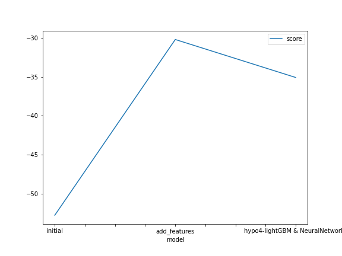
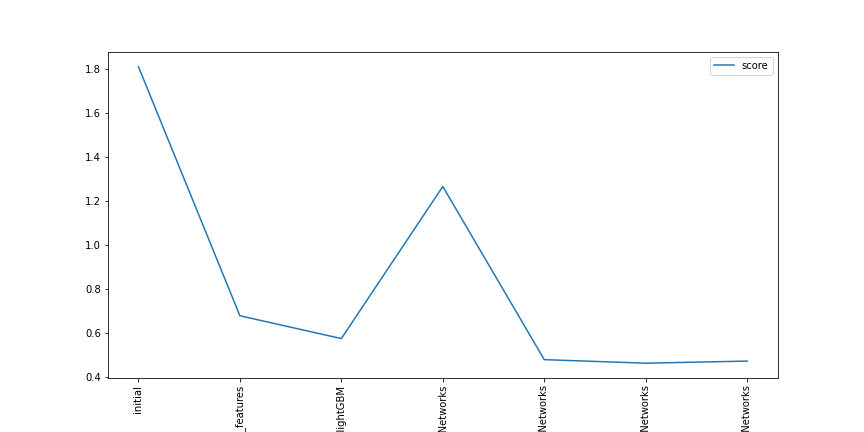

# Report: Predict Bike Sharing Demand with AutoGluon Solution
#### Thura Tun

## Initial Training
### What did you realize when you tried to submit your predictions? What changes were needed to the output of the predictor to submit your results?
TODO: When I tried to submit my predictions results of initial training, I realized that we need to to count how many negative values of predictions that might be achieved by RMSE evaluation metrics. I knew that the Kaggle only accept the predictions that are greater than 0. Therefore, we need to count these negative values in the predictions, and essentially need to set these negative values to zero. Then, we can assign these predictions to submission dataframe, and finally submit to Kaggle.

### What was the top ranked model that performed?
TODO: The top rank model was the third model `hypo3-lightGBM & NeuralNetworks` which was trained with featurized data, and also by tuning on `lighGBM & NeuralNetworks` model algorithms. The kaggle RMSE score of the top rank model was 0.46291.

## Exploratory data analysis and feature creation
### What did the exploratory analysis find and how did you add additional features?
TODO: The **first finding** was `datetime` column with `object` dtype can be changed into `datetime` dtype, and we can also add more features by splitting separate column of `year`, `month`, `day`, `hour` and `dayofweek` from datetime column. And then, plotting the histogram of the training data during EDA gave me insight to the distributions of each feature in the data as the **second finding**. I seen there are two main type; *caegorical* and *continuous* data based on their distribution. Among categorical data, `season` and `weather` feature is more informative while `holiday` and `workingday` are just in binary distribution. Therefore, I converted informative `season` and `weather` data into `categorical` type from `int64`.  

### How much better did your model preform after adding additional features and why do you think that is?
TODO: My model performed better after adding additional features. The Kaggle score of `root_mean_square_error` (RMSE) was reduced to `0.67806` from `1.80870`. I think it is because additional features and categorized data help the model for better learning the patterns related between the feature and the target. 

## Hyper parameter tuning
### How much better did your model preform after trying different hyper parameters?
TODO: Trying with some model algorithms such as `lightGBM` and `NeuralNets` and its related hyperparameters significantly improved the model performance. Tuning on the hyperparameters such as `num_trials`, `num_folds` and `searcher` made highly impact on the model performance. The best Kaggle RMSE score achieved after trying with different hyperparameters is `0.46291`.

### If you were given more time with this dataset, where do you think you would spend more time?
TODO: I will try to do the following experiments;
1. Try to explore different feature enginerring techniques on the data.
2. Read the detials of AutoGluon documentation especially about TabularPredictor().fit(), and explore the availabel parpameters to tune.
3. Choose the best trained model, and tune on it.
4. Train with different model algorithm such as Random Forest, KNN, XGBoost.

### Create a table with the models you ran, the hyperparameters modified, and the kaggle score.
|model|ime_limit|presets|num_epochs|num_boost_round|num_trials|num_folds|searcher|score|
|--|--|--|--|--|--|--|--|--|
|initial|600|best_quality|default|default|default|default|default|1.80870|
|add_features|600|best_quality|default|default|default|default|default|0.67806|
|hypo0-lightGBM|600|best_quality|default|50|4|5|auto|0.57451|
|hypo1-NeuralNetworks|600|best_quality|10|default|4|5|auto|1.26499|
|hypo2-lightGBM & NeuralNetworks|600|best_quality|15|100|8|9|random|0.47889|
|hypo3-lightGBM & NeuralNetworks|900|high_quality|15|100|8|9|random|0.46291|
|hypo4-lightGBM & NeuralNetworks|900|best_quality|15|100|6|12|random|0.47240|

### Create a line plot showing the top model score for the three (or more) training runs during the project.

TODO: Replace the image below with your own.

### Create a line plot showing the top kaggle score for the three (or more) prediction submissions during the project.

TODO: Replace the image below with your own.

## Summary
TODO: In this project, the regression model was trained with AutoGluon for predicting bike sharing demand. The dataset is availabe at Kaggle and it provides the historical data of bike sharing data for training, testing as well as for submission. The project was implemented in AWS Sagemaker Studio and running with `ml.t3.medium` instance (2 vCPU + 4 GiB), and kernel `Python 3 (MXNet 1.8 Python 3.7 CPU Optimized)`. All the necessary packages are installed including AutoGluon, and kaggle which enable to download the dataset using the command via notebook.

And then, trying to read the dataframe and drop some unecessary features from the train data if they are not present in test data. The initial model was trained on this less analyzed and not much featurized data. The initial benchmark of initial RMSE score was achieved by 1.80870 after doing initial Kaggle submission.

Next step was going through with exploratory data analysis (EDA) and feature creation. Feature engineering was performed based on the datetime column and the distribution of the data visualized by histogram plot. The training after feature engineering leaded the model to a better performance. The Kagge RMSE score achieved by this trained model was 0.67806.

Hyperparameter tuning was taken after EDA. Tuning was done by playing some hyperparameters on lightGBM and Neural Networks model algorithms. Hyperparameter parsing with Neural Networks algorithm made significant degraded performance while lightGBM gave a better result. Trying with combinations of lightGBM and Neural Networks gave significant better performance up to 0.47~0.46 RMSE score. Tuning on hyperparameters such as num_trials, num_folds and searcher made highly impact on the results.

Lastly, I stopped the model fitting and hyperparameters tuning for saving the provided bills by AWS. But, further improvements can be performed by spending more time with some experiments.
